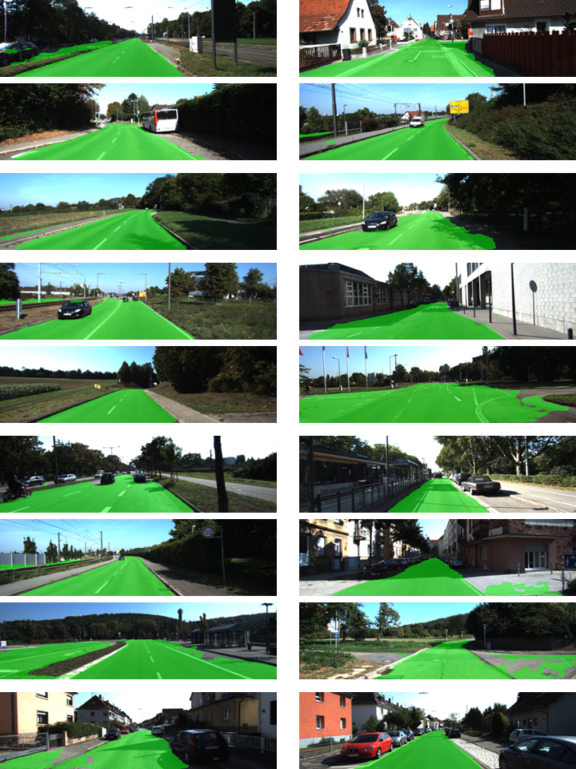
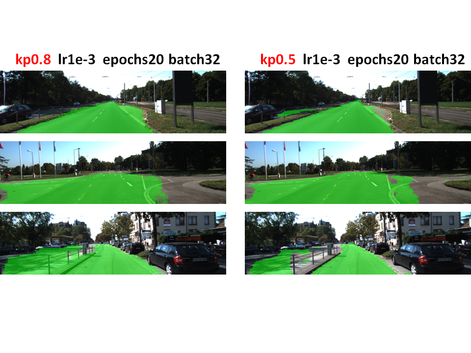

# **Self-Driving Car Engineer Nanodegree** #

# **Term3 – Project2: Semantic Segmentation** #

## **INTRODUCTION** ##

The purpose of this Semantic Segmentation project is to label pixels of
a road in images using Fully Convolutional Network(FCN). The steps taken
to accomplish these tasks are:

-   Start with a pre-trained VGG16 Convolutional Neural Network.
    Download .pb image

    

-   Build the FCN using VGG16 as the first half of the model.

-   The second half of the model will have 1X1D convolutions of the
    extracted layers, and transposed, added using skip layers.

-   Use 289 pixel labeled images in the data\_road folder to train the
    FCN

-   Predict pixels (road or not road) for 290 images

-   Perform inference on saved model for faster image prediction (Work
    in Progress)

## **Training data set** ##

The training data set consisted of 289 images (on folder image\_2) and
the corresponding pixel-labeled images (on folder gt\_image\_2) with 3
classes: not-road, road, secondary road (not used for this project):

Image size was 1242x375 pixels.

## **Functions implemented** ##

LOAD\_VGG

Loads the model

input: Pretrained VGG Model (.pb graph, variables, index)

output: Tuple of Tensors from VGG model (image\_input, keep\_prob,
layer3\_out, layer4\_out, layer7\_out)

LAYERS

Creates the layers for a fully convolutional network (using skip layers
and transpose)

input: Tuple of Tensors from VGG model and \# of classes

output: last layer of NN

OPTIMIZE

TensorFLow loss and optimizer operations

input: last layer of NN, correct label, lr, \#classes

output: logits, train\_op, cross\_entropy\_loss

TRAIN\_NN

Train neural network and print out the loss during training

input: sess, epochs, batch\_size, get\_batches\_fn, train\_op,
cross\_entropy\_loss, input\_image, correct\_label, keep\_prob,
learning\_rate

output: none. Just sess.run() and epochs implementation

## **Parameters chosen for FCN** ##

1-Use kernel initializer on layers:
tf.random\_normal\_initializer(stddev=0.01)

2-Use kernel regularizer on layers:
tf.contrib.layers.l2\_regularizer(1e-3)

3-keep\_prob = 0.5

4-learning\_rate = 1e-3

5-epochs = 50

6-batch\_size = 4

The FCN was run on Amazon AWS EC2 cloud. Region was set to OREGON and
type to P2.xlarge (Tesla K80 GPU). Tesla K80 has 4992 CUDA cores. It
took 4004secs to train the FCN.

## **Predictions** ##

The model losses decrease over time over 50 epochs (shown in different
colors):

{width="6.0in" height="4.0in"}

The model predicts most of the road correctly:

## **Sensitivity to parameters** ##

## **Conclusions** ##

A FCN is able to predict correctly most of the road on the test
pictures. The FCN is created by using a pretrained VGG16 CNN, extracting
its layers, and performing 1x1 convolutions and transposed(or upsampled)
layers on them. Skip connections are added to connect the extracted
layers to the transposed layers.

## **Inference for performance (work in progress)** ##

-Freeze the graph. Folder contents are:

base\_graph.pb

checkpoint

frozen\_graph.pb

ss\_model.ckpt.data-00000-of-00001

ss\_model.ckpt.index

ss\_model.ckpt.meta

-Fusion

-Quantization

-Compilation
